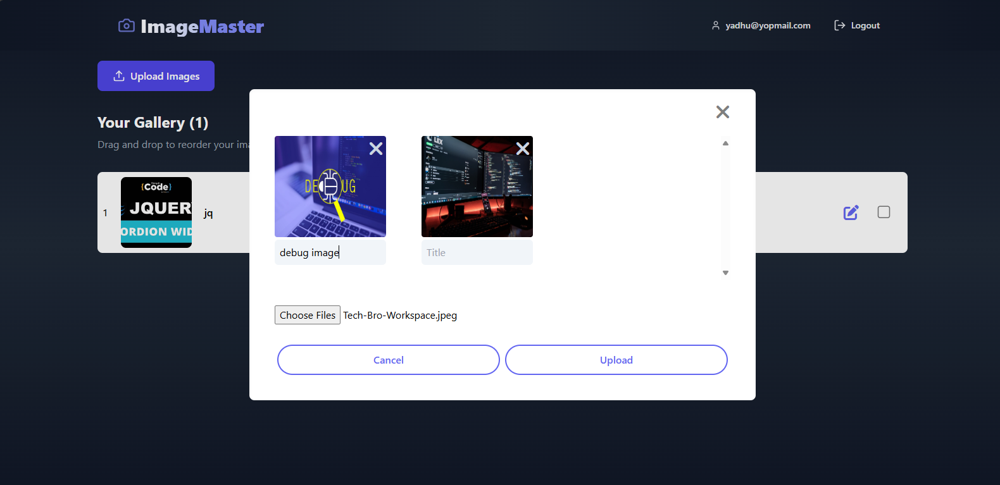

# MERN Image Upload and Management Application

## Overview

This is a full-stack MERN application that allows users to register, login, and manage images with various features like adding, editing, deleting, and rearranging images using drag-and-drop functionality. The application is divided into frontend and backend, leveraging React for the frontend and Express with MongoDB for the backend.



## Features and Functionalities

1. **Register, Login, and Reset Password**:
   - Register users using email, phone number, and password.
   - Secure login using ExpressJS and MongoDB.
   - Password reset functionality available.

2. **Add Images with Title**:
   - Users can bulk upload images with specific titles for each image.
   - View, edit, and delete options available for uploaded images.

3. **Rearrange Selected Images**:
   - Users can rearrange uploaded images using drag-and-drop functionality.   

4. **Edit and Delete**:
   - Users can edit both the title and the image itself for their uploads.
   - Option to delete images is provided.

## Tech Stack

- **Frontend**: React, Tailwind CSS
- **Backend**: Node.js, ExpressJS
- **Database**: MongoDB
- **Authentication**: JWT (JSON Web Tokens)
- **File Upload**: Multer, AWS S3

## Setup Instructions

### 1. Clone the Repository

   git clone https://github.com/yadhukishore/imagemaster.git

### 2. Install Dependencies
- **For Backend:**
   Navigate to the backend folder:

   ```bash
     cd backend
   ```
   Install backend dependencies:
   
   ```bash
     npm install
   ```

- **For Frontend:**
   Navigate to the frontend folder:

   ```bash
     cd ../frontend
   ```
   Install frontend dependencies:
   
   ```bash
     npm install
   ```

### 3. Setup Environment Variables
   Create a .env file in the backend folder and configure the following environment variables:

   - PORT=4000
   - CLIENT_BASE_URL=http://localhost:3000
   - USER=your_email@example.com
   - APP_PASSWORD=your_app_password_here
   - MONGODB_URL=your_mongodb_url_here
   - JWT_SECRET=your_jwt_secret_key_here
   - AWS_ACCESS_KEY_ID=your_aws_access_key_id_here
   - AWS_SECRET_ACCESS_KEY=your_aws_secret_access_key_here
   - AWS_REGION=your_aws_region_here
   - AWS_BUCKET_NAME=your_aws_bucket_name_here

   Create a .env file in the frontend folder and configure the following environment variables:
   - REACT_APP_BASE_URL=http://localhost:4000

### 4. Running the Application

- **Running the Backend:**
    Start the backend server:
  
     ```bash
     npm start
     ```
  
     The backend will run on [http://localhost:4000](http://localhost:4000).

- **Running the Frontend:**
     Start the frontend React app:
  
     ```bash
     npm start
     ```
  
     The frontend will run on [http://localhost:3000](http://localhost:3000).

### 5. Access the Application
   Once both servers are running, Open your browser and visit http://localhost:3000

